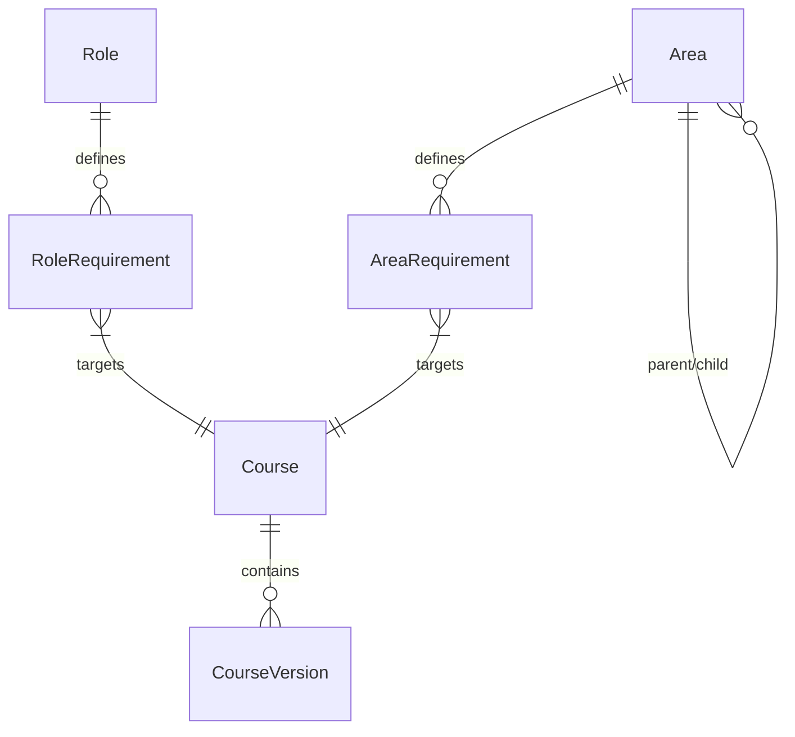

# [MOD-1.0] System Setup & Foundational Libraries

## Metadata

| Details | Value |
| :--- | :--- |
| **Phase** | Phase 1 (MVP Foundation) |
| **Owner** | Frank (Senior HSE Supervisor) |
| **Dependencies** | None (Root dependency for all other modules) |
| **Tech Context** | NestJS Domain: `libs/titan/training` |

---

## 1. Executive Summary

This module acts as the "Constitution" of the Project Titan system. It digitizes the abstract safety rules of the project into rigid, queryable data structures.

> [!IMPORTANT]
> **Critical Function:** If data is not defined here (e.g., a Course, a Job Role, or a Work Zone), it does not exist in the project universe. This module has no "Compliance Logic" itself; it merely defines the Rules that Module 2.0 (Compliance Engine) will enforce.

---

## 2. The Three Pillars of Safety

Module 1 is composed of three interconnected libraries:

### 1.1 Training Library (The "What")
*   **Purpose:** The Master Catalog of all safety qualifications.
*   **Key Architecture:**
    *   **Parent-Child Versioning:** Courses are split into `Course` (Stable ID, e.g., "Fire Safety") and `CourseVersion` (Specific Syllabus, e.g., "v1.0 - 2024").
    *   **Prerequisites:** Courses can require other courses (e.g., "Advanced Rigging" requires "Basic Rigging").
*   **Status:** Defined in [[SPEC-1.1](file:///c:/Users/dogus/Documents/Coding/VibeCoding/Workspaces/titan/.agent/docs/02_FEATURE_SETS/PHASE_1_MVP/01_FOUNDATIONS/SPEC-1.1_Trainings.md)].

### 1.2 Role Library (The "Who")
*   **Purpose:** Defines training requirements based on a person's Job Title.
*   **Key Architecture:**
    *   **Single Primary Role:** A user has exactly one Job Role (e.g., "Rigger") to ensure deterministic logic.
    *   **Strict Compliance:** All assigned training is Mandatory. (No "Recommended" status).
    *   **Compliance Anchors:**
        *   **Pre-Mob:** Must be done before entry.
        *   **Post-Mob:** Timer starts when the Role is assigned, with a configurable Grace Period (e.g., 30 days).
*   **Status:** Defined in [[SPEC-1.2](file:///c:/Users/dogus/Documents/Coding/VibeCoding/Workspaces/titan/.agent/docs/02_FEATURE_SETS/PHASE_1_MVP/01_FOUNDATIONS/SPEC-1.2_Roles.md)].

### 1.3 Area Library (The "Where")
*   **Purpose:** Defines training requirements based on Physical Locations.
*   **Key Architecture:**
    *   **Infinite Hierarchy:** Areas are nested (`Site > Process Area > Unit 4`).
    *   **Inheritance:** Workers in a child zone automatically inherit requirements from all parent zones.
    *   **Multi-Zone Assignment:** Workers can be authorized for multiple disjoint areas simultaneously.
*   **Status:** Defined in [[SPEC-1.3](file:///c:/Users/dogus/Documents/Coding/VibeCoding/Workspaces/titan/.agent/docs/02_FEATURE_SETS/PHASE_1_MVP/01_FOUNDATIONS/SPEC-1.3_Areas.md)].

---

## 3. The "Conflict" Resolution Logic

When the Compliance Engine (Module 2.0) calculates a worker's status, it resolves overlapping requirements using the **"Strictest Wins"** protocol:

1.  **Union of Requirements:** The system collects all course requirements from the user's Role AND all assigned Areas (plus inherited areas).
2.  **Deduplication:** If "Fire Safety" is required by both Role and Area, it is listed once.
3.  **Priority Handling:**
    *   If Source A says Mandatory (Post-Mob) and Source B says Mandatory (Pre-Mob)...
    *   **Result:** Mandatory (Pre-Mob) (The Stricter rule applies).

---

## 4. Entity Relationship Map (ERD Summary)

> [!NOTE]
> **Summary:**
> *   `Course (1) <---> (N) CourseVersion`
> *   `Role (1) <---> (N) RoleRequirement <---> (1) Course (Parent)`
> *   `Area (1) <---> (N) AreaRequirement <---> (1) Course (Parent)`
> *   `Area (Parent) <---> (N) Area (Children)`
