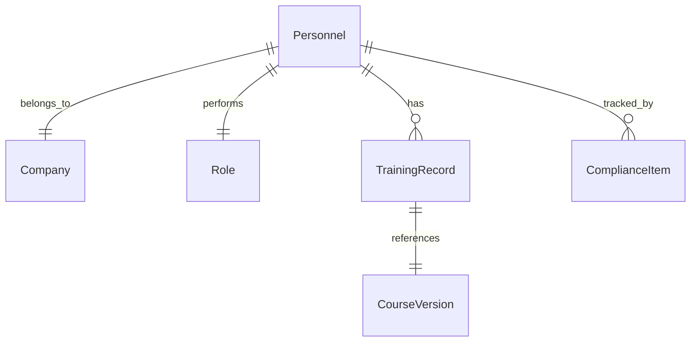

# [MOD-2.0] Personnel & Compliance Management

## Metadata

| Details | Value |
| :--- | :--- |
| **Phase** | Phase 1 (MVP Core) |
| **Owner** | Frank (Senior HSE Supervisor) |
| **Dependencies** | Requires [[MOD-1.0](file:///c:/Users/dogus/Documents/Coding/VibeCoding/Workspaces/titan/.agent/docs/02_FEATURE_SETS/PHASE_1_MVP/01_FOUNDATIONS/MOD-1.0_Architecture.md)] (Courses, Roles, Areas) |
| **Tech Context** | NestJS Domain: `libs/titan/personnel` & `libs/titan/compliance` |

---

## 1. Executive Summary

This module is the operational engine of Project Titan. It manages the "Digital Twin" of every worker and enforces the **"Audit Shield"** philosophy.

> [!IMPORTANT]
> **Critical Function:** It transforms static rules (e.g., "Riggers need Training") into dynamic, legally defensible status (e.g., "John Smith is Compliant"). It guarantees that every Green status is backed by a verifiable evidence file.

---

## 2. The Three Operational Pillars

Module 2 is composed of three interconnected systems:

### 2.1 Personnel Profiles (The "Who")
*   **Purpose:** Manages the digital identity of all workers on site.
*   **Key Architecture:**
    *   **Company Library:** Subcontractors are strict database entities (not text) to ensure accurate reporting.
    *   **Global Uniqueness:** The `employee_id` (Badge ID) is the unique key across the entire project.
    *   **Lifecycle Management:** A rigid status Enum (`ACTIVE`, `INACTIVE`, `BLACKLISTED`) controls site access, superseding simple date ranges.
*   **Status:** Defined in [[SPEC-2.1](file:///c:/Users/dogus/Documents/Coding/VibeCoding/Workspaces/titan/.agent/docs/02_FEATURE_SETS/PHASE_1_MVP/02_OPERATIONS/SPEC-2.1_Personnel.md)].

### 2.2 Training Records (The "Evidence")
*   **Purpose:** The immutable ledger of completed training.
*   **Key Architecture:**
    *   **Mandatory Evidence:** A record cannot be saved without an uploaded Proof File (PDF/Image).
    *   **Integrity Hashing:** Every uploaded file is hashed (**SHA-256**) to prove it hasn't been tampered with since upload.
    *   **User Override:** Users can manually override the calculated Expiry Date to match the physical certificate's printed date.
*   **Status:** Defined in [[SPEC-2.2](file:///c:/Users/dogus/Documents/Coding/VibeCoding/Workspaces/titan/.agent/docs/02_FEATURE_SETS/PHASE_1_MVP/02_OPERATIONS/SPEC-2.2_Training-Records.md)].

### 2.3 The Compliance Engine (The "Brain")
*   **Purpose:** A logic processor that continuously answers: "Is this worker safe to work?"
*   **Key Architecture:**
    *   **Hybrid Trigger System:**
        *   **Event-Driven:** Recalculates immediately when data changes (e.g., Upload Record, Change Role).
        *   **Time-Driven:** A nightly Cron job finds records that naturally expired "yesterday" and flips them to Red.
    *   **Snapshot Storage:** Calculations are stored in `ComplianceItem` tables. The Dashboard reads the stored result ($O(1)$ complexity), ensuring 60-second audit retrieval.
*   **Status:** Defined in [[SPEC-2.3](file:///c:/Users/dogus/Documents/Coding/VibeCoding/Workspaces/titan/.agent/docs/02_FEATURE_SETS/PHASE_1_MVP/02_OPERATIONS/SPEC-2.3_Compliance.md)].

---

## 3. The Compliance Logic (The "Traffic Light")

The engine determines status based on Stacking Rules (from Mod 1.3) and Evidence (from Mod 2.2).

| Status | Color | Definition |
| :--- | :--- | :--- |
| **COMPLIANT** | GREEN | Valid evidence exists for all mandatory items. |
| **PENDING** | YELLOW | A Post-Mob requirement is missing, but the Grace Period (e.g., 30 days) has not yet expired. |
| **NON-COMPLIANT** | RED | A Pre-Mob requirement is missing OR a Post-Mob grace period has expired OR a record is Expired. |

> [!CAUTION]
> **The Aggregation Rule:**
> The "Overall Status" for a worker follows the **Worst Case Scenario**:
> *   If they have **1 Red Item** $\to$ Overall **RED**.
> *   If they have **0 Red but 1 Yellow** $\to$ Overall **YELLOW**.
> *   Only if **All Items are Green** $\to$ Overall **GREEN**.

---

## 4. Entity Relationship Map (ERD Summary)

> [!NOTE]
> **Summary:**
> *   `Personnel (1) <---> (1) Company`
> *   `Personnel (1) <---> (1) Role (Links to Requirements)`
> *   `Personnel (1) <---> (N) TrainingRecord (Links to Evidence)`
> *   `Personnel (1) <---> (N) ComplianceItem (The Snapshot Result)`
