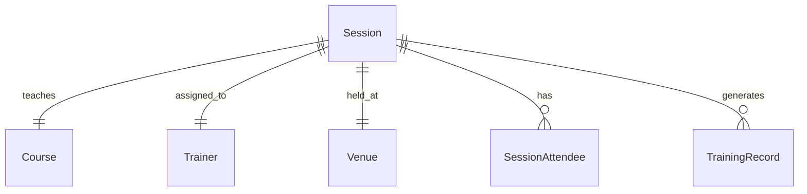

# [MOD-3.0] Training Session Management

## Metadata

| Details | Value |
| :--- | :--- |
| **Phase** | Phase 1 (MVP Logistics) |
| **Owner** | Frank (Senior HSE Supervisor) |
| **Dependencies** | Requires [[MOD-1.0](file:///c:/Users/dogus/Documents/Coding/VibeCoding/Workspaces/titan/.agent/docs/02_FEATURE_SETS/PHASE_1_MVP/01_FOUNDATIONS/MOD-1.0_Architecture.md)] (Courses) and [[MOD-2.0](file:///c:/Users/dogus/Documents/Coding/VibeCoding/Workspaces/titan/.agent/docs/02_FEATURE_SETS/PHASE_1_MVP/02_OPERATIONS/MOD-2.0_Architecture.md)] (Personnel) |
| **Tech Context** | NestJS Domain: `libs/titan/session` |

---

## 1. Executive Summary

This module handles the physical logistics of safety training. It transforms the "Red" indicators on the dashboard into scheduled, executed, and verified training events.

> [!IMPORTANT]
> **Critical Function:** It provides a rigid workflow for planning sessions, managing capacity, and—most importantly—converting a physical attendance sheet into legally binding digital records via the **"Finalize Gate"**.

---

## 2. The Three Logistical Pillars

Module 3 is composed of three interconnected systems:

### 3.1 Resource Libraries (The "Inputs")
*   **Purpose:** Manages the constraints of Trainers and Venues.
*   **Key Architecture:**
    *   **Hard Qualification Block:** A trainer cannot be assigned to a session unless explicitly linked to that Course in the DB.
    *   **Conflict Detection:** Prevents double-booking trainers (Hard Block) and warns on Venue capacity overlaps (Soft Block).
*   **Status:** Defined in [[SPEC-3.1](file:///c:/Users/dogus/Documents/Coding/VibeCoding/Workspaces/titan/.agent/docs/02_FEATURE_SETS/PHASE_1_MVP/03_LOGISTICS/SPEC-3.1_Resources.md)].

### 3.2 Session Planning (The "Scheduler")
*   **Purpose:** The flexible workspace for organizing events.
*   **Key Architecture:**
    *   **Flexible Drafts:** Allows saving incomplete plans (e.g., "Need Fire Safety next Tuesday") without locking in a Venue or Trainer immediately.
    *   **Smart Suggestions:** A picker tool that prioritizes "Red" (Non-Compliant) and "Yellow" (Expiring) workers but allows the Admin to invite anyone.
    *   **Trainer Load Visibility:** Displays "Hours Booked This Week" to help Admins avoid burnout, without enforcing rigid blocking.
*   **Status:** Defined in [[SPEC-3.2](file:///c:/Users/dogus/Documents/Coding/VibeCoding/Workspaces/titan/.agent/docs/02_FEATURE_SETS/PHASE_1_MVP/03_LOGISTICS/SPEC-3.2_Sessions.md)].

### 3.3 Post-Session Processing (The "Output")
*   **Purpose:** The transaction gate that finalizes the event.
*   **Key Architecture:**
    *   **The Finalize Gate:** Records are not created real-time. The Admin must click "Finalize Session" to trigger an atomic batch write. This prevents "partial" or erroneous data.
    *   **Result Tracking:** Supports `PASSED` (Green) and `FAILED` (Recorded but Non-Compliant) statuses.
    *   **Automatic Branching:** If a course requires verification, the system creates a `CompetencyRecord` (Pending) instead of a final `TrainingRecord`.
*   **Status:** Defined in [[SPEC-2.3](file:///c:/Users/dogus/Documents/Coding/VibeCoding/Workspaces/titan/.agent/docs/02_FEATURE_SETS/PHASE_1_MVP/02_OPERATIONS/SPEC-2.3_Compliance.md)] (Logic) and [[SPEC-4.1](file:///c:/Users/dogus/Documents/Coding/VibeCoding/Workspaces/titan/.agent/docs/02_FEATURE_SETS/PHASE_1_MVP/04_COMPETENCY/SPEC-4.1_Competency.md)] (Verification).

---

## 3. The Data Flow (From Plan to Proof)

1.  **Draft:** Admin creates a session for "H2S Awareness".
2.  **Schedule:** Admin assigns Trainer X and Venue Y. System checks conflicts.
3.  **Invite:** Admin selects 20 workers using the "Smart Picker".
4.  **Execute:** Session happens. Trainer marks 18 Present, 2 No-Show.
5.  **Evidence:** Trainer uploads one signed attendance PDF.
6.  **Finalize:** Admin clicks "Finalize".
    *   System creates 18 `TrainingRecords`.
    *   All 18 records link to the same PDF file key.
    *   **Compliance Engine runs** $\to$ 18 Workers turn Green.

---

## 4. Entity Relationship Map (ERD Summary)

> [!NOTE]
> **Summary:**
> *   `Session (1) <---> (1) Course`
> *   `Session (1) <---> (1) Trainer`
> *   `Session (1) <---> (1) Venue`
> *   `Session (1) <---> (N) SessionAttendee (The Class List)`
> *   `Session (1) <---> (N) TrainingRecord (The Final Output)`
