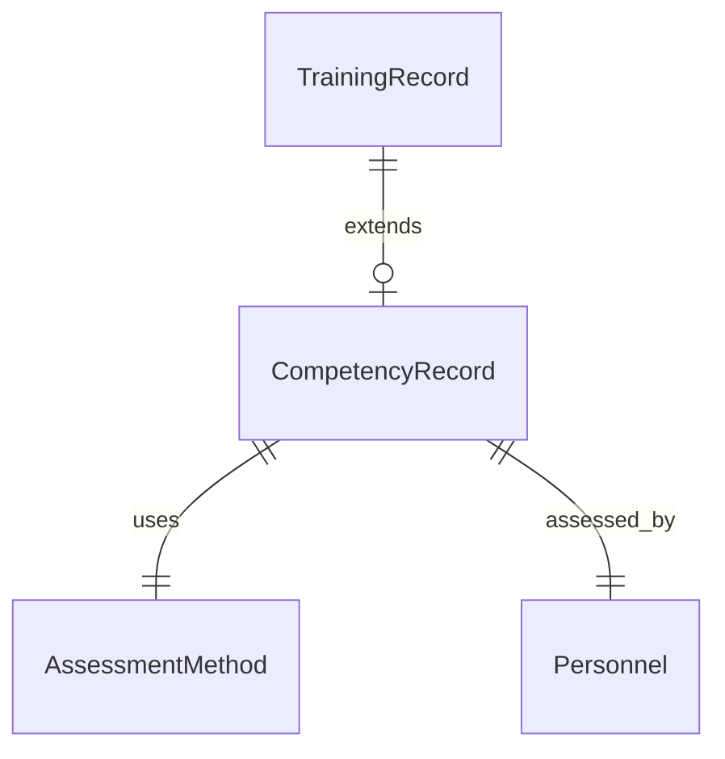

# [MOD-4.0] Competency Verification

## Metadata

| Details | Value |
| :--- | :--- |
| **Phase** | Phase 1 (MVP Final) |
| **Owner** | Frank (Senior HSE Supervisor) |
| **Dependencies** | Requires [[MOD-3.0](file:///c:/Users/dogus/Documents/Coding/VibeCoding/Workspaces/titan/.agent/docs/02_FEATURE_SETS/PHASE_1_MVP/03_LOGISTICS/MOD-3.0_Architecture.md)] (Training Records) |
| **Tech Context** | NestJS Domain: `libs/titan/competency` |

---

## 1. Executive Summary

This module manages the "Practical Assessment" layer of the safety system. It acts as a final gatekeeper for high-risk roles (e.g., Riggers, Confined Space Entrants).

> [!IMPORTANT]
> **Critical Function:** It prevents workers from turning "Green" (Compliant) solely based on classroom attendance. It enforces a secondary **"Practical Sign-Off"** that is dynamic, context-rich, and audit-proof.

---

## 2. The Verification Pillars

Module 4 is built on flexibility to accommodate real-world field conditions:

### 4.1 The Dynamic Workflow (Fast vs. Slow)
*   **Purpose:** Allows verification to happen at the speed of operations.
*   **Key Architecture:**
    *   **Fast Track:** Verification can occur inside the Training Session (Module 3.3). If a trainer ticks "Verified" during attendance, the worker skips the "Pending" queue entirely.
    *   **Slow Track:** For workers needing later assessment, the system queues them in a "Pending Verification" Dashboard for individual sign-off.
*   **Status:** Defined in [[SPEC-4.1](file:///c:/Users/dogus/Documents/Coding/VibeCoding/Workspaces/titan/.agent/docs/02_FEATURE_SETS/PHASE_1_MVP/04_COMPETENCY/SPEC-4.1_Competency.md)].

### 4.2 The Global Method Library
*   **Purpose:** Prevents operational bottlenecks caused by rigid configuration.
*   **Key Architecture:**
    *   **Global Selection:** Assessment methods (e.g., "VR Simulator", "Live Observation", "Written Exam") are managed in a central library available to all courses.
    *   **Benefit:** A trainer can select the actual method used on the day (e.g., swapping to "Simulator" due to rain) without being blocked by strict Course Configuration settings.

### 4.3 Context & Liability
*   **Purpose:** Captures the "Why" behind the result.
*   **Key Architecture:**
    *   **Rich Remarks:** The remarks field is critical. It differentiates a generic "Pass" from a specific "Demonstrated excellent load control."
    *   **Failure Tracking:** A `NOT_COMPETENT` result is saved as a permanent history record. It proves the company attempted to verify the worker but found them unsafe, which is a powerful liability shield.

---

## 3. The Competency Logic

The Compliance Engine (Mod 2.3) is updated to respect this new layer:

1.  **Check 1:** Does the user have a valid `TrainingRecord`?
    *   No $\to$ **RED**
    *   Yes $\to$ Proceed to Check 2.
2.  **Check 2:** Does the Course require Verification?
    *   No $\to$ **GREEN** (Theory is enough).
    *   Yes $\to$ Check linked `CompetencyRecord`.
        *   If `Status == PENDING` $\to$ **BLUE** (Treated as Red/Restricted).
        *   If `Status == NOT_COMPETENT` $\to$ **RED**.
        *   If `Status == COMPETENT` $\to$ **GREEN**.

---

## 4. Entity Relationship Map (ERD Summary)

> [!NOTE]
> **Summary:**
> *   `CompetencyRecord (1) <---> (1) TrainingRecord (The Parent)`: It is a 1-to-1 extension. A Training Record has exactly one Competency state.
> *   `CompetencyRecord (1) <---> (1) AssessmentMethod (The "How")`
> *   `CompetencyRecord (1) <---> (1) Personnel (The Assessor/Signer)`
